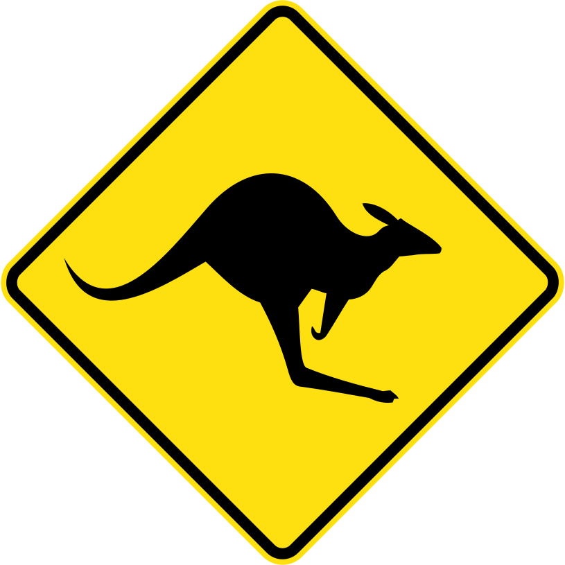

  <h1>KAN-GA-ROO</h1>
  <h2>I-dont't-understand</h3>
  <blockquote>
  Cook and Banks were exploring the area when they happened upon the animal. 
  They asked a nearby local what the creatures were called.
  The local responded <strong>"Kangaroo"</strong>, meaning <strong>"I don't understand you"</strong>, 
  which Cook took to be the name of the creature. 
  </blockquote> 
    

Under the heavy development